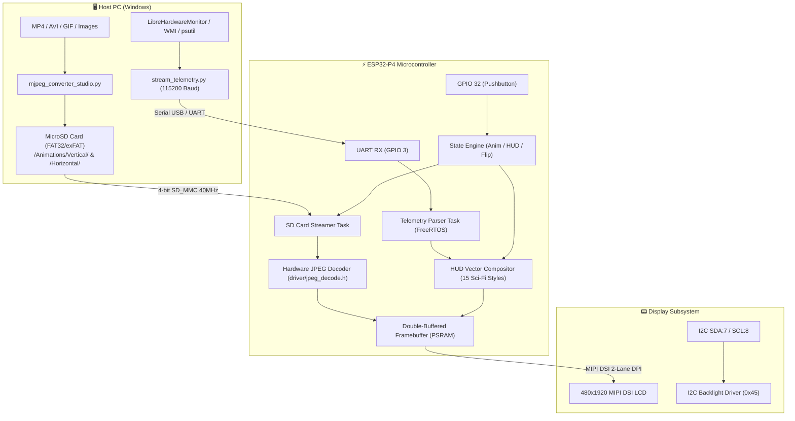

# ESP32-P4 MIPI DSI Animation & Telemetry Display System

[](https://www.espressif.com/en/products/socs/esp32-p4)
[-blue.svg)]()
[]()
[]()
[]()
[](LICENSE)

An end-to-end, high-performance animation playback and sci-fi telemetry display ecosystem engineered for the **ESP32-P4** RISC-V microcontroller. It leverages native **MIPI DSI 2-lane** display driving, **hardware JPEG decoding**, high-speed **4-bit SD_MMC streaming**, and real-time double-buffered graphics to deliver high-frame-rate video playback overlaid with **15 customizable Sci-Fi HUD telemetry dashboards**.

The repository includes firmware sketches, a suite of Python desktop tools (Sci-Fi Video Converter & MJPEG Player Studio), and a real-time PC hardware telemetry streaming engine.

---

## 📑 Table of Contents

- [System Architecture](#-system-architecture)
- [Repository Structure](#-repository-structure)
- [Key Features](#-key-features)
- [Hardware & Pinout Specifications](#-hardware--pinout-specifications)
- [Firmware Suite](#-firmware-suite)
  - [01. Flash Image Slideshow](#01-flash-image-slideshow)
  - [02. SD Card MJPEG Player](#02-sd-card-mjpeg-player)
  - [03. SD Card MJPEG + Telemetry HUD](#03-sd-card-mjpeg--telemetry-hud)
- [15 Sci-Fi Telemetry HUD Styles](#-15-sci-fi-telemetry-hud-styles)
- [MicroSD Card Setup](#-microsd-card-setup)
- [Desktop Tools & Python Suite](#-desktop-tools--python-suite)
  - [MJPEG Studio & Video Converters](#mjpeg-studio--video-converters)
  - [PC Hardware Telemetry Streamer](#pc-hardware-telemetry-streamer)
- [Telemetry Protocol Specification](#-telemetry-protocol-specification)
- [Controls & Navigation](#-controls--navigation)
- [Troubleshooting & FAQ](#-troubleshooting--faq)
- [License](#-license)

---

## 🏗️ System Architecture



---

## 📁 Repository Structure

```text
ESP32_P4_DSI/
├── firmware/                               # Microcontroller Arduino / ESP-IDF sketches
│   ├── 01_flash_image_slideshow/           # ROM / Flash PROGMEM JPEG image player
│   │   ├── 01_flash_image_slideshow.ino    # Arduino sketch
│   │   ├── image_data.h                    # C header with PROGMEM JPEG byte arrays
│   │   └── images/                         # Source image sequence (1.jpg .. 18.jpg)
│   │
│   ├── 02_sd_mjpeg_player/                 # SD Card hardware MJPEG video player
│   │   └── 02_sd_mjpeg_player.ino          # Arduino sketch (clean high-FPS playback)
│   │
│   └── 03_sd_mjpeg_telemetry_hud/          # SD MJPEG player + 15 Sci-Fi HUDs + Serial telemetry
│       └── 03_sd_mjpeg_telemetry_hud.ino   # Arduino sketch (full featured system)
│
├── tools/                                  # PC Host Software & Utilities
│   ├── mjpeg_studio/                       # Video conversion & preview studio
│   │   ├── mjpeg_converter_studio.py       # Sci-Fi GUI batch video converter & MJPEG player
│   │   ├── convert_video_cli.py            # Lightweight CLI video-to-MJPEG script
│   │   ├── mjpeg_player_gui.py             # Standalone lightweight MJPEG player GUI
│   │   ├── image_to_c_header.py            # Converts images into image_data.h PROGMEM arrays
│   │   └── requirements.txt                # opencv-python, pillow, numpy
│   │
│   └── pc_telemetry/                       # Real-time PC sensor telemetry stream service
│       ├── stream_telemetry.py             # Self-contained serial telemetry streamer & sensor reader
│       ├── LibreHardwareMonitor/           # Pre-compiled LibreHardwareMonitor libraries & DLLs
│       └── requirements.txt                # pyserial, psutil, pythonnet
│
├── Animations/                             # Converted animation binaries (ready for SD card)
│   ├── Horizontal/                         # Landscape orientation clips
│   └── Vertical/                           # Portrait orientation clips
│
├── .gitignore                              # Git ignore rules
├── requirements.txt                        # Unified project-wide Python requirements
└── README.md                               # Project documentation
```

---

## 🌟 Key Features

* **Hardware-Accelerated Decoding**: Utilizes the ESP32-P4 dedicated hardware JPEG decoder engine (`driver/jpeg_decode.h`) for decoding full-resolution frames in real time.
* **Double-Buffered MIPI DSI Driver**: Native 2-lane MIPI DSI interface with hardware LDO PHY power management and tear-free double framebuffer ping-ponging.
* **High-Throughput SD_MMC (4-Bit)**: 40 MHz 4-bit bus interface delivering the necessary bandwidth for continuous high-bitrate video streaming.
* **15 Dynamic Sci-Fi Telemetry HUDs**: Live vector telemetry overlays featuring anti-aliased cards, circular dials, targeting reticles, concentric rings, neon gauges, and status rails.
* **Multi-Threaded Architecture**: FreeRTOS tasks separate SD card streaming, JPEG hardware decoding, serial packet parsing, and HUD rendering across both RISC-V cores.
* **Orientation & Mode Control**: Real-time toggling between **Portrait (480x1920)** and **Landscape (1920x480)** orientations, with state preservation via EEPROM/Preferences.
* **Comprehensive Desktop Studio**: Sci-Fi themed GUI application for batch-converting video files (MP4, AVI, MOV, MKV, GIF, Image sequences) into resolution-scaled, rotated `.mjpeg` streams with timeline scrubbing and playback inspection.

---

## 🛠️ Hardware & Pinout Specifications

### Recommended Hardware
* **Microcontroller**: DFRobot FireBeetle 2 ESP32-P4 (or compatible ESP32-P4 development board).
* **Display**: 480x1920 / 1920x480 MIPI DSI LCD panel (e.g., Waveshare / DFRobot).
* **Storage**: MicroSD Card formatted in FAT32 or exFAT (Class 10 / U3 recommended).
* **Input**: Pushbutton connected between `GPIO 32` and `GND`.

### 📌 Pin Mapping

| Peripheral | Signal Name | ESP32-P4 GPIO | Description / Notes |
| :--- | :--- | :--- | :--- |
| **SD_MMC** | `CLK` | **GPIO 43** | SD Bus Clock (40 MHz) |
| **SD_MMC** | `CMD` | **GPIO 44** | SD Command / Response line |
| **SD_MMC** | `D0` | **GPIO 39** | Data Line 0 |
| **SD_MMC** | `D1` | **GPIO 40** | Data Line 1 |
| **SD_MMC** | `D2` | **GPIO 41** | Data Line 2 |
| **SD_MMC** | `D3` | **GPIO 42** | Data Line 3 / Card Detect |
| **MIPI DSI** | `LCD_RST` | **GPIO 23** | LCD Hardware Reset |
| **Backlight** | `I2C SDA` | **GPIO 7** | Backlight controller SDA (Addr: `0x45`) |
| **Backlight** | `I2C SCL` | **GPIO 8** | Backlight controller SCL (Addr: `0x45`) |
| **Backlight** | `GPIO BL` | **GPIO 26** | Fallback PWM / Digital backlight control |
| **Button** | `KEY` | **GPIO 32** | User input button (Active LOW, internal pull-up) |
| **UART0** | `RX / TX` | **Default (USB)** | Serial telemetry input & debug console (115200 baud) |

---

## 🚀 Firmware Suite

All firmware sketches are located under `firmware/`.

### 01. Flash Image Slideshow
📂 `firmware/01_flash_image_slideshow/01_flash_image_slideshow.ino`
* **Purpose**: Standalone slideshow for boards without an SD card.
* **How it works**: Decodes JPEG images stored directly in ESP32 Flash memory (`image_data.h` via `PROGMEM`).
* **Tool**: Use `tools/mjpeg_studio/image_to_c_header.py` to compile your own images into `image_data.h`.

### 02. SD Card MJPEG Player
📂 `firmware/02_sd_mjpeg_player/02_sd_mjpeg_player.ino`
* **Purpose**: Clean, maximum-performance video playback directly from MicroSD card.
* **How it works**: Streams `.mjpeg` video files from `/Animations/Vertical/` or `/Animations/Horizontal/` without any telemetry overlay. Single-click advances to the next clip; long-press switches orientation.

### 03. SD Card MJPEG + Telemetry HUD
📂 `firmware/03_sd_mjpeg_telemetry_hud/03_sd_mjpeg_telemetry_hud.ino`
* **Purpose**: Complete system combining SD card video playback with live PC telemetry HUD overlays.
* **How it works**: Parses incoming serial telemetry packets from the host PC, blends live sensor readings (CPU/GPU temperature, usage, RAM, clock/date) over background animations, and allows cycling through 15 HUD layouts.

### ⚡ Comprehensive Firmware Flashing Guide

Follow these steps to compile and flash the firmware onto your ESP32-P4 board:

#### Step 1: Install Arduino IDE & ESP32 Board Core
1. Download and install **[Arduino IDE 2.x](https://www.arduino.cc/en/software)**.
2. Open Arduino IDE and navigate to **File ➔ Preferences**.
3. In **Additional Board Manager URLs**, add:
   ```text
   https://espressif.github.io/arduino-esp32/package_esp32_index.json
   ```
4. Go to **Tools ➔ Board ➔ Boards Manager...**, search for **esp32** by *Espressif Systems*, and install **version 3.0.0 or higher** (ESP32-P4 support requires Core 3.0+).

#### Step 2: Install Required Libraries
Open **Tools ➔ Manage Libraries...** (or `Ctrl+Shift+I`) and install:
* **ArduinoJson** (v6.x or v7.x by *Benoît Blanchon*)
* *(Note: `SD_MMC`, `Wire`, `Preferences`, and the MIPI DSI / JPEG hardware drivers are built into the ESP32 core).*

#### Step 3: Configure Board Settings
1. Open the desired sketch, for example:
   [`firmware/03_sd_mjpeg_telemetry_hud/03_sd_mjpeg_telemetry_hud.ino`](file:///d:/Codes/P4_DSI/ESP32_P4_DSI/firmware/03_sd_mjpeg_telemetry_hud/03_sd_mjpeg_telemetry_hud.ino)
2. Under **Tools**, configure the following options:
   * **Board**: `ESP32-P4 Dev Module` (or your specific board like `DFRobot FireBeetle 2 ESP32-P4`)
   * **CPU Frequency**: `400MHz (High Performance)`
   * **Flash Mode**: `QIO 80MHz`
   * **PSRAM**: `Enabled (OPI PSRAM)`
   * **Partition Scheme**: `Default 4MB with SPIFFS` (or `16MB Flash / Large SPIFFS` matching your module)
   * **Port**: Select the corresponding COM port (e.g. `COM13`)

#### Step 4: Upload Firmware
1. Connect your ESP32-P4 board to your computer via USB-C.
2. Click the **Upload** button (`Ctrl+U`).
3. *(Optional)* If the upload does not automatically begin, enter bootloader mode: hold down the **BOOT** button, press and release the **RST** button, then release **BOOT**.
4. Once flashed, open the **Serial Monitor** at **115200 baud** to view initialization logs and confirm display/SD mounting status.

---

## 📊 15 Sci-Fi Telemetry HUD Styles

Double-clicking the control button cycles through 15 distinct HUD layout styles in real-time:

| # | HUD Style | Visual Layout Description |
| :-: | :--- | :--- |
| **1** | **Cards** | Classic 4-card HUD grid with translucent rounded panels, progress bars, and glowing headers. |
| **2** | **Dials** | 3 large minimalist radial gauge dials displaying CPU %, GPU %, and RAM %. |
| **3** | **Sidebar** | Asymmetric left-docked status column + system load distribution matrix. |
| **4** | **Top Bar** | Slim, futuristic full-width telemetry status strip pinned to the top edge. |
| **5** | **Bottom Bar** | Slim telemetry status strip pinned along the bottom edge of the display. |
| **6** | **Corner Minimal** | Wireframe tactical sci-fi corner brackets with crisp numeric telemetry readouts. |
| **7** | **Concentric Rings** | High-density triple concentric circular rings in a central cluster. |
| **8** | **Left Rail** | Vertical status bar and sensor stack docked exclusively along the left margin. |
| **9** | **Right Rail** | Vertical status bar and sensor stack docked exclusively along the right margin. |
| **10** | **Diagonal Cascade** | Staggered, asymmetric polygon cards with angled accent cutaways. |
| **11** | **Targeting HUD** | Tactical crosshair brackets with an aggregate circular core and targeting telemetry. |
| **12** | **Split Bar** | Top military time/date status strip paired with twin floating lower dials. |
| **13** | **Circular Cluster** | Tight arc cluster of 3 high-precision mini circular dials with percent readouts. |
| **14** | **Matrix Grid** | Cyber-terminal layout featuring compact numeric telemetry cells and bar graphs. |
| **15** | **Cyberpunk Gauges** | High-contrast neon segmented vertical meters and dynamic system load indicators. |

---

## 💾 MicroSD Card Setup & Animation Extraction

### Step 1: Format the MicroSD Card
* Use a high-speed MicroSD card (Class 10 / UHS-I / U3 recommended).
* Format the card as **FAT32** (for cards ≤32GB) or **exFAT** (for cards ≥64GB).

### Step 2: Extract & Copy Animations from `Animation.zip`
1. Locate your `Animation.zip` (or `Animations.zip`) package.
2. Unzip/extract the contents on your PC.
3. On the root of your MicroSD card, create a folder named `Animations`.
4. Inside the `Animations` folder, create two subfolders: `Horizontal` and `Vertical`.
5. Copy **ONLY the `.mjpeg` binary files** into the matching subfolders:

> [!IMPORTANT]
> **Copy ONLY `.mjpeg` files!**
> Do not copy `.mp4`, `.avi`, `.mov`, `.zip`, `.py`, `.git`, or hidden OS folders (`__MACOSX`, `.DS_Store`, `Thumbs.db`) onto the SD card. The ESP32 hardware JPEG decoder strictly expects binary `.mjpeg` video streams.

```text
MicroSD Card Root/
└── Animations/
    ├── Horizontal/
    │   ├── a1.mjpeg
    │   ├── a2.mjpeg
    │   ├── a3.mjpeg
    │   └── ...
    └── Vertical/
        ├── a1.mjpeg
        ├── a2.mjpeg
        ├── a3.mjpeg
        └── ...
```

* **Naming Convention**: Files must be named with prefix `a` followed by the clip number (e.g. `a1.mjpeg`, `a2.mjpeg`, `a3.mjpeg` ... up to `a45.mjpeg`).
* Safely eject the MicroSD card from your PC and insert it into the ESP32-P4 SD card slot.

---

## 🖥️ Desktop Tools & Python Suite

Install all Python dependencies from the repository root:

```bash
pip install -r requirements.txt
```

### MJPEG Studio & Video Converters
📂 `tools/mjpeg_studio/`

#### 1. Unified Batch Converter & MJPEG Player Studio (GUI)
```bash
python tools/mjpeg_studio/mjpeg_converter_studio.py
```
* **Batch Conversion**: Converts MP4, AVI, MOV, MKV, GIFs, or image sequences into scaled, rotated `.mjpeg` files.
* **Integrated Timeline Player**: Scrub through video frames, inspect resolution/fps, step forward/backward, and adjust playback speed.
* **Auto Sizing**: Presets for 480x1920 (Vertical) and 1920x480 (Horizontal).

#### 2. Lightweight CLI Converter
```bash
python tools/mjpeg_studio/convert_video_cli.py [input_video.mp4] [output_video.mjpeg]
```

#### 3. Standalone MJPEG Player GUI
```bash
python tools/mjpeg_studio/mjpeg_player_gui.py
```

#### 4. Flash Image Header Generator
```bash
python tools/mjpeg_studio/image_to_c_header.py [images_folder] [output_folder]
```

---

### PC Hardware Telemetry Streamer
📂 `tools/pc_telemetry/`

The telemetry service monitors your PC's hardware sensors (CPU/GPU temperature, load, RAM usage, time) and streams packets to the ESP32 over serial.

```bash
# Run telemetry streaming service (defaults to COM13, or pass port as argument)
python tools/pc_telemetry/stream_telemetry.py COM13
```

* **Sensor Backend**: Utilizes `LibreHardwareMonitorLib.dll` for deep hardware access with automatic fallback to Windows WMI/CIM and `psutil`.
* **Auto-Reconnect**: Seamlessly recovers connection if the USB cable is unplugged and reconnected.
* **Live Console Dashboard**: Prints a styled terminal dashboard displaying real-time metrics being transmitted.

---

## 📡 Telemetry Protocol Specification

Telemetry data is transmitted over USB Serial at **115200 baud** once per second.

### CSV Packet Structure (Default)
```text
$TEL:<cpu_temp>,<cpu_usage>,<gpu_temp>,<gpu_usage>,<mem_usage>,<date>,<time>\n
```

#### Example Packet
```text
$TEL:48.5,23,55.0,41,62,2026-08-26,16:05:00\n
```

| Field Index | Field Name | Data Type | Example Value | Description |
| :-: | :--- | :--- | :--- | :--- |
| Header | `$TEL:` | String | `$TEL:` | Packet frame identifier |
| 1 | `cpu_temp` | Float (°C) | `48.5` | CPU Package Temperature |
| 2 | `cpu_usage`| Integer (%) | `23` | CPU Total Utilization (0-100) |
| 3 | `gpu_temp` | Float (°C) | `55.0` | Primary GPU Core Temperature |
| 4 | `gpu_usage`| Integer (%) | `41` | GPU Core Utilization (0-100) |
| 5 | `mem_usage`| Integer (%) | `62` | System RAM Utilization (0-100) |
| 6 | `date` | String | `2026-08-26` | Current Host Date (`YYYY-MM-DD`) |
| 7 | `time` | String | `16:05:00` | Current Host 24-Hour Time (`HH:MM:SS`) |

---

## 🕹️ Controls & Navigation

The single push-button on **GPIO 32** controls all interactive functions:

| User Action | Firmware Response |
| :--- | :--- |
| **Single Click** | Advance to next background animation clip (`a1` ➔ `a2` ➔ `...`) |
| **Double Click** | Cycle to next Sci-Fi HUD layout style (Style 1 ➔ 15) |
| **Long Press (2.0s)** | Toggle screen orientation between **Vertical (Portrait)** and **Horizontal (Landscape)** |

*All user preferences (current orientation, selected HUD style, last animation index) are saved to non-volatile flash memory via `Preferences`.*

---

## ❓ Troubleshooting & FAQ

<details>
<summary><b>1. SD Card fails to mount ("SD_MMC Mount Failed")</b></summary>

* Verify the SD card is formatted as FAT32 or exFAT.
* Ensure pin definitions match your board (`CLK: 43`, `CMD: 44`, `D0: 39`, `D1: 40`, `D2: 41`, `D3: 42`).
* Ensure 4-bit mode is enabled in the sketch: `SD_MMC.begin("/sdcard", false, true, 40000)`.
* Check that pull-up resistors are present on the SD_MMC lines if your board requires them.
</details>

<details>
<summary><b>2. Display backlight is off or screen is black</b></summary>

* The display uses an I2C backlight controller on address `0x45` (SDA: GPIO 7, SCL: GPIO 8). Verify I2C connections.
* Check if LCD reset pin (GPIO 23) is connected correctly.
* Increase `LCD_BRIGHTNESS_PCT` in the sketch configuration section if the backlight is set too dim.
</details>

<details>
<summary><b>3. PC Telemetry shows "Error opening serial port"</b></summary>

* Close the Arduino IDE Serial Monitor if open, as it locks the COM port.
* Check Device Manager on Windows to confirm the COM port number (e.g. `COM13`) and pass it to the script: `python tools/pc_telemetry/stream_telemetry.py COM13`.
* Run the terminal / prompt as Administrator if LibreHardwareMonitor requires elevated privileges for motherboard sensors.
</details>

---
